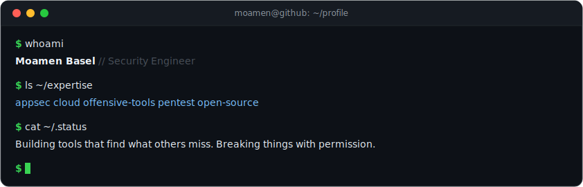

<div align="center">



<br/>

[](https://twitter.com/momenbassel)
&nbsp;&nbsp;
[](https://github.com/momenbasel)

</div>

---

### Arsenal

```
Languages       Python  -  JavaScript  -  Swift  -  Go  -  TypeScript  -  PHP  -  Bash
Security        Burp Suite  -  Caido  -  Semgrep  -  CodeQL  -  Nuclei  -  Frida  -  Ghidra
Infrastructure  AWS  -  Docker  -  Kubernetes  -  Terraform  -  GCP
Platforms       Linux  -  macOS  -  Android  -  iOS
```

---

### Stats

<div align="center">


<br/>


</div>

---

<div align="center">

*If something I built helped you, a star goes a long way.*

</div>
